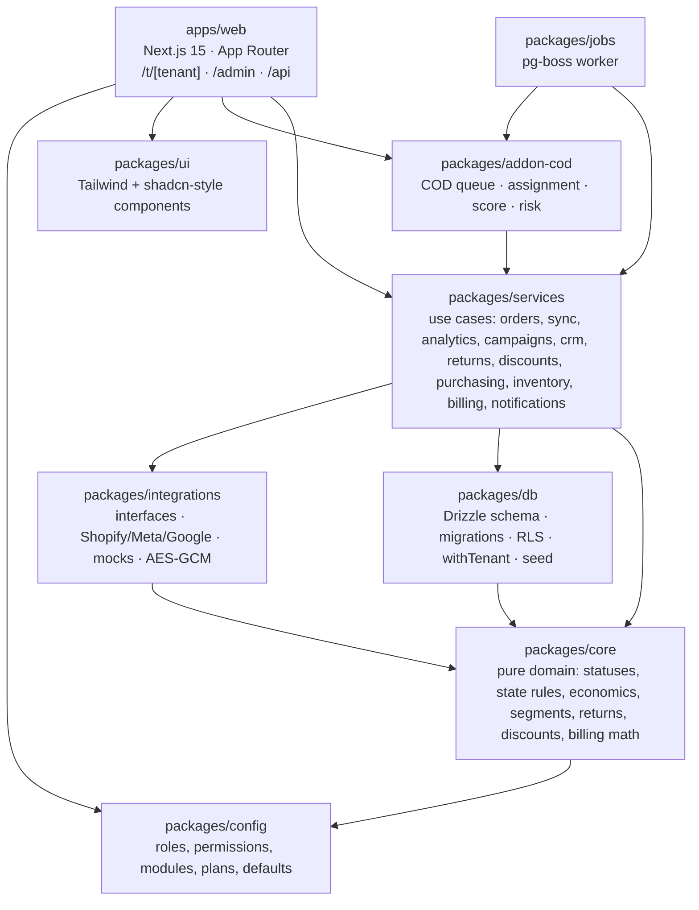
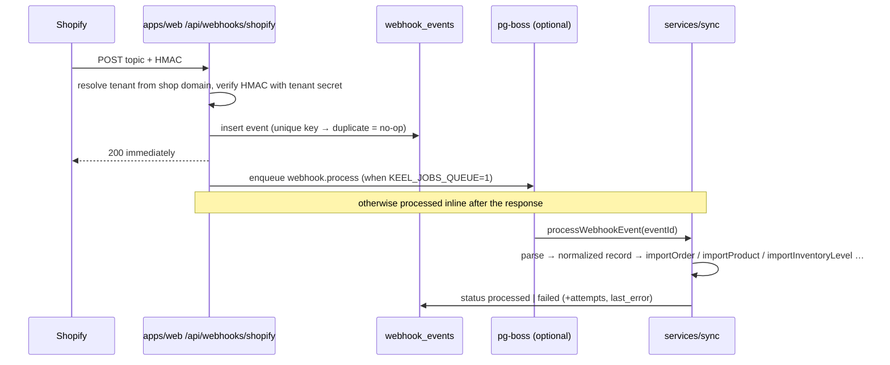

# Architecture

Keel is a pnpm + Turborepo monorepo. One Next.js app, one worker, seven packages. Everything a tenant sees goes through a Row Level Security transaction; everything the platform owner does goes through an admin connection that is audited.

## Packages

Rules the graph enforces:

- `core` has no I/O. Every economic number (margin, profit, ROAS, P/L, RFM bands, delivery score) is a pure function with tests.
- `services` is the only layer that combines `db`, `core` and `integrations`. Web pages and job handlers call services; they never write SQL for domain tables.
- `addon-cod` imports the core packages, never the other way round. Deleting the package leaves the core compiling.
- `integrations` knows nothing about tenants or the database. It receives credentials and returns normalized records.

## Tenancy and security

- Every domain table has `tenant_id uuid not null` with an index and an RLS policy on `current_setting('app.tenant_id')`.
- `withTenant(tenantId, fn)` opens a transaction, runs `set_config('app.tenant_id', …, true)` (transaction-local, so pooled connections never leak a tenant) and hands the transaction to `fn`. No domain query exists outside it.
- Two database roles: `keel_app` (subject to RLS, used by requests and the worker) and `keel_admin` (`BYPASSRLS`, used by migrations, the seed, the console and the billing job). Super-admin actions on a tenant write `audit_logs` with `actorType: impersonation`.
- `packages/db/test/isolation.test.ts` discovers every table with `tenant_id` and proves, for each, that tenant A cannot select, update, delete or insert tenant B's rows and that nothing is visible without a tenant context. Add-on tables are allowed to be populated for one tenant only; tables without `tenant_id` must be allow-listed explicitly.
- Permissions: `packages/config/src/roles.ts` holds a matrix role × page → `none | read | write`, plus named actions (`change_status`, `pause_campaign`, `export`, `manage_integrations`, …). `requirePage` / `requireAction` in `apps/web/src/server/tenant.ts` return a 404 when the role lacks the page or the module is off, so a disabled add-on is unreachable even by URL.
- Credentials for integrations are encrypted at rest with AES-GCM (`APP_ENCRYPTION_KEY`).

## Data model

56 tables, grouped. All domain tables carry `tenant_id`, `created_at`, `updated_at`.

| Group | Tables | Notes |
| --- | --- | --- |
| Auth and platform | `users`, `accounts`, `sessions`, `verification_tokens`, `tenants`, `tenant_memberships`, `tenant_tax_rates`, `tenant_addons`, `audit_logs`, `notifications` | A user belongs to many tenants with one role per tenant. Tenant settings (country, currency, timezone, locale, order prefix, thresholds, fees, return rules) are a validated JSON column. |
| Integrations | `integrations`, `integration_health`, `sync_runs`, `webhook_events` | One row per provider per tenant with `mode` (`mock`/`live`), status, encrypted credentials. `webhook_events` is unique on (source, topic, external id, source updated at): the idempotency key. `sync_runs` holds the cursor so a sync resumes. |
| Catalog and stock | `products`, `product_variants`, `locations`, `inventory_levels`, `inventory_movements`, `cost_settings` | Variants carry `option_values` as a JSON map, no hard-coded size or colour. Movements are the ledger behind stock changes. |
| Customers and orders | `customers`, `orders`, `order_lines`, `order_discounts`, `order_attribution`, `order_events`, `order_notes` | `orders.status` is the canonical state written only by `recomputeOrderStatus`. `order_events` is the timeline with author and field diff. `search_blob` is a generated column with a trigram index. |
| Shipments | `shipments`, `shipment_events`, `shipment_source_states`, `shipment_status_mappings` | One row per source per shipment; the resolver picks the visible status. |
| Rules | `state_rules` | Per tenant, ordered by priority: conditions on tags, payment method, financial and fulfillment status → canonical status. |
| Returns and discounts | `return_reasons`, `return_requests`, `return_lines`, `discounts`, `discount_pools` | Return reasons and workflow outcomes are tenant data. Pools generate unique codes in bulk. |
| Purchasing | `suppliers`, `supplier_payments`, `purchase_orders`, `purchase_order_lines`, `backorders` | Receiving a PO moves stock, updates the latest product cost (feeds P/L) and closes backorders. |
| Marketing | `campaigns`, `ad_metrics_daily`, `campaign_product_links`, `segments`, `segment_memberships` | Segments store nested AND/OR rules as JSON plus `holdout_percentage`; memberships keep a stable group per customer. |
| Billing | `subscriptions`, `invoices` | Keel owns the ledger; the provider only collects. |
| Add-on COD | `cod_settings`, `cod_queue_items`, `cod_attempts`, `cod_operator_capacity`, `cod_capacity_exceptions`, `cod_assignment_log`, `cod_recipient_profiles` | Only read and written by `@keel/addon-cod`. |

### Canonical order status

`new → pending_review → confirmed → fulfilling → shipped → delivered`, plus `on_hold`, `cancelled`, `returned_partial`, `returned`, `refunded`.

`deriveOrderStatus(input, rules)` in `packages/core/src/state-rules.ts` applies, in order: certain facts (cancelled, refunded, returned fractions), a manual status set by staff, the shipment status, the tenant's `state_rules` by priority, and finally the platform's own payment and fulfillment facts. No tag is interpreted by code; tags are only inputs to tenant-defined rules, with a preview over the last 50 orders in the UI.

### Economics

`orderEconomics` in `packages/core/src/finance.ts` is the single source for revenue net of tax (rate by tenant country), product cost (latest purchase cost), shipping, payment fees (basis points per method), returns and ad spend. The sale scope used everywhere (dashboard, P/L, campaigns, discounts) is `confirmed, fulfilling, shipped, delivered, returned_partial`. Money is stored in integer minor units; rates in basis points.

### Shipment status from many sources

Each source (Shopify today; a carrier or 3PL tomorrow) writes its own row in `shipment_source_states`. `resolveShipmentStatus` picks the visible status by precedence (lower priority number wins while its data is fresh), keeps exceptions sticky for a configurable number of days and records conflicts, so adding a carrier feed is a new source row, not a schema change.

## Integration flows

### Webhook (Shopify)

Failed events are retried by the `retry` tick every 10 minutes up to a maximum number of attempts, then stay visible on the Integrations page for manual replay.

### Sync and reconciliation

- `runOrdersSync(kind)` with `kind = initial | delta | reconcile` pages through the platform with a cursor stored in `sync_runs`; it stops at a time budget and resumes from the cursor on the next tick. `reconcile` re-reads the last N days nightly.
- `runCatalogSync` imports products, variants, locations, inventory levels and discounts.
- `runAdsSync(provider, window)` pulls campaigns and daily insights in resumable date windows; recent days are re-pulled because platforms restate them.
- Each run writes `integration_health` (ok/error, last error text, rows written, freshness) which the Integrations page shows together with "Test connection" and "Resync".

Worker schedule (`packages/jobs/src/worker.ts`): delta every 15 min, retry every 10 min, ads daily at 06:00, reconcile nightly at 03:00, billing at 04:30, COD tick every 10 min.

### Attribution

`extractAttribution` reads UTM parameters and click ids from the order's landing and referring URLs and note attributes, derives a channel, and `matchCampaign` links the order to a campaign by external id, UTM campaign or name. Campaign profit counts only attributed orders in the sale scope, never cancelled or returned ones.

## Adding an adapter

1. Implement one of the interfaces in `packages/integrations/src/types.ts` (`CommercePlatform`, `AdsPlatform`, `AnalyticsPlatform`, `MessagingChannel`, `WarehouseProvider`, `CarrierProvider`). Return the normalized types; never leak provider payloads upward.
2. Use `HttpClient` from `packages/integrations/src/http.ts`: it injects `fetch`, retries on 429/5xx with `Retry-After`, and maps errors to `IntegrationError` codes (`rate_limit`, `auth`, `permission`, `not_found`, `transient`).
3. Record real responses as fixtures under `__fixtures__/` and test the adapter with `fixtureFetch(routes)`; no network in tests.
4. Register the provider in `packages/services/src/integrations/factory.ts` (how to build it from decrypted credentials) and add the credential shape to `crypto.ts` consumers.
5. Add a guide page under `apps/web/src/app/t/[tenant]/integrations/guide/[provider]` and its translations; mark provider-UI-dependent steps with the "To verify" badge.
6. For a per-account connector (3PL, WhatsApp), keep the module entry in `packages/config/src/modules.ts` as `availability: "on_request"` until a customer pays for it.

## Adding an add-on

1. Create `packages/addon-<name>` depending on `@keel/config`, `@keel/core`, `@keel/db`, `@keel/services`. Pure logic in the package root with tests, services under `src/services`.
2. Add its tables to `packages/db/src/schema/<name>.ts` with `tenant_id` and the standard RLS policy, then `pnpm db:generate`. The isolation suite picks them up automatically; list them in `ADDON_ONLY` if only some tenants will have rows.
3. Register `addon.<name>` in `packages/config/src/modules.ts` with its pages and monthly price, and the pages in the permission matrix in `roles.ts`.
4. Pages live under `apps/web/src/app/t/[tenant]/<name>`; `requirePage` already answers 404 when the add-on is off for the tenant. Add the nav entries behind `isPageEnabled`.
5. Background work: add a `TickJob` kind and a handler in `packages/jobs/src/handlers.ts` that iterates only tenants with the add-on active.
6. Activation is a row in `tenant_addons` written from the super-admin console with a note and date; the billing run adds the add-on line to the next invoice.

## Web app layout

- `apps/web/src/server/tenant.ts`: `getTenantContext(slug)` resolves membership (or super-admin impersonation), tenant settings, active add-ons and locale; `ctx.run(fn)` wraps `withTenant`.
- `apps/web/src/server/actions/*`: server actions, each starting with `requireAction`, writing through services, auditing with `auditActor(ctx)`.
- `apps/web/src/server/queries/*`: read models for lists (server-side filters, pagination, counts).
- i18n: `next-intl`, messages per locale under `apps/web/messages/<locale>`; a test fails when keys differ between languages. Dates, numbers and currencies always go through `Intl` with the tenant's locale, currency and timezone.
- Auth: Auth.js with credentials and magic link (printed to the console in development); JWT sessions; middleware protects everything outside `/login`.

## Testing

| Layer | Tool | What |
| --- | --- | --- |
| core, integrations, addon-cod pure | Vitest | Pure functions, adapters on recorded fixtures, hand-computed P/L on three orders |
| db | Vitest + PostgreSQL | Migrations apply, seed runs, one isolation test per tenant table |
| services, addon-cod services | Vitest + PostgreSQL | Use cases on the seeded test database |
| web | Vitest | Translation parity, helpers |
| e2e | Playwright | 39 scenarios against the production build: login in three languages, permissions and 404 on disabled modules, every module's main flow, the console |
