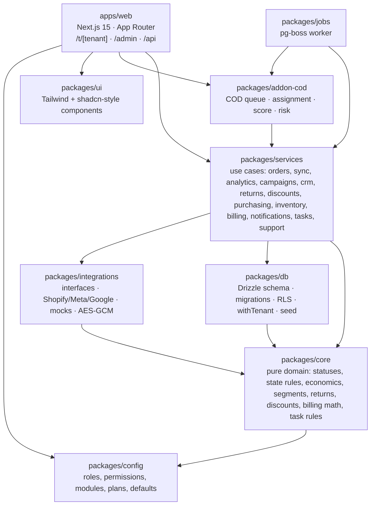
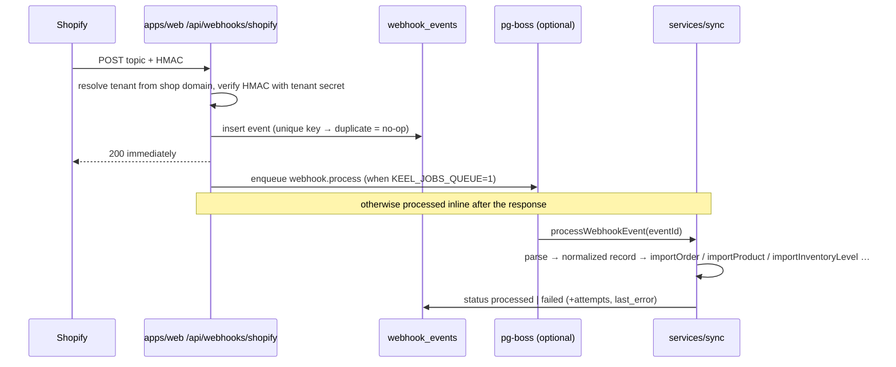
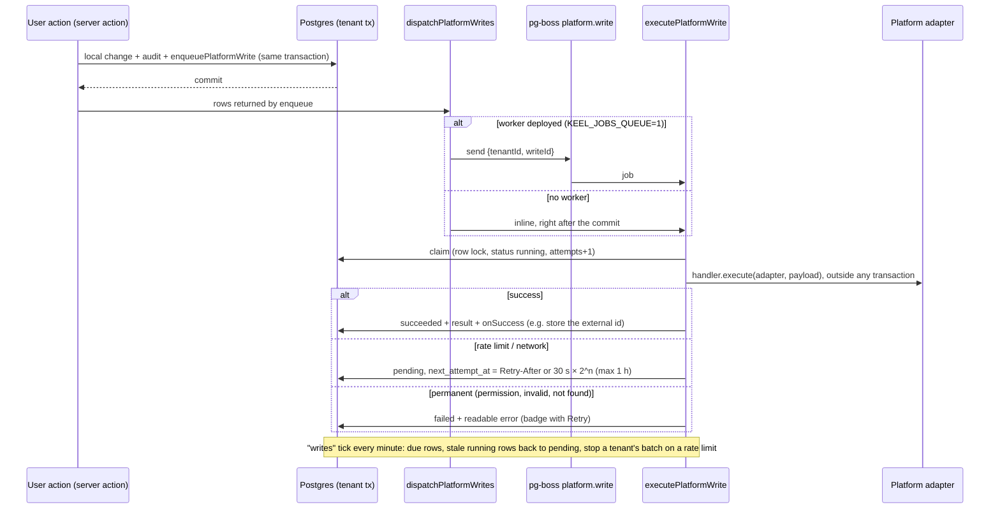
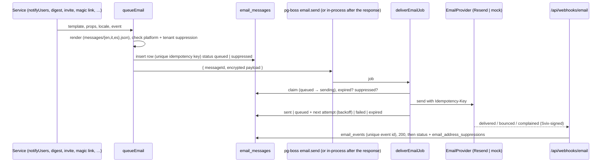

# Architecture

Keel is a pnpm + Turborepo monorepo. One Next.js app, one worker, seven packages. Everything a tenant sees goes through a Row Level Security transaction; everything the platform owner does goes through an admin connection that is audited.

## Packages



Rules the graph enforces:

- `core` has no I/O. Every economic number (margin, profit, ROAS, P/L, RFM bands, delivery score) is a pure function with tests.
- `services` is the only layer that combines `db`, `core` and `integrations`. Web pages and job handlers call services; they never write SQL for domain tables.
- `addon-cod` imports the core packages, never the other way round. Deleting the package leaves the core compiling.
- `integrations` knows nothing about tenants or the database. It receives credentials and returns normalized records.

## Tenancy and security

- Every domain table has `tenant_id uuid not null` with an index and an RLS policy on `current_setting('app.tenant_id')`.
- `withTenant(tenantId, fn)` opens a transaction, runs `set_config('app.tenant_id', …, true)` (transaction-local, so pooled connections never leak a tenant) and hands the transaction to `fn`. No domain query exists outside it.
- Two database roles: `keel_app` (subject to RLS, used by requests and the worker) and `keel_admin` (`BYPASSRLS`, used by migrations, the seed, the console and the billing job). Super-admin actions on a tenant write `audit_logs` with `actorType: impersonation`.
- `packages/db/test/isolation.test.ts` discovers every table with `tenant_id` and proves, for each, that tenant A cannot select, update, delete or insert tenant B's rows and that nothing is visible without a tenant context. Add-on tables are allowed to be populated for one tenant only; tables without `tenant_id` must be allow-listed explicitly.
- Permissions: `packages/config/src/roles.ts` holds a matrix role × page → `none | read | write`, plus named actions (`change_status`, `pause_campaign`, `export`, `manage_integrations`, …). `requirePage` / `requireAction` in `apps/web/src/server/tenant.ts` return a 404 when the role lacks the page or the module is off, so a disabled add-on is unreachable even by URL.
- Credentials for integrations are encrypted at rest with AES-GCM (`APP_ENCRYPTION_KEY`).
- Tenant lifecycle and access: `suspended` and `churned` tenants keep their users out (`isTenantBlocked`, redirect to `/suspended` with a reason category); jobs and public pages run for `trial`, `active` and `past_due` (`isTenantOperational`). A user disabled platform-wide (`users.disabled_at`) is refused by every sign-in method and has no valid session.

## Data model

126 tables, grouped. All domain tables carry `tenant_id`, `created_at`, `updated_at`.

| Group | Tables | Notes |
| --- | --- | --- |
| Auth and platform | `users`, `user_sign_ins`, `accounts`, `sessions`, `verification_tokens`, `password_resets`, `tenants`, `tenant_memberships`, `invitations`, `tenant_tax_rates`, `tenant_addons`, `tenant_branding`, `audit_logs`, `notifications` | A user belongs to many tenants with one role per tenant; people join through `invitations` (token stored as SHA-256, 7 days, single use). `password_resets` holds forgotten-password requests (60-minute single-use tokens, rate-limit rows also for unknown addresses). Tenant settings (country, currency, timezone, locale, order prefix, thresholds, fees, return rules) are a validated JSON column. |
| Integrations | `integrations`, `integration_health`, `sync_runs`, `webhook_events`, `platform_writes` | One row per provider per tenant with `mode` (`mock`/`live`), status, encrypted credentials. `webhook_events` is unique on (source, topic, external id, source updated at): the idempotency key. `sync_runs` holds the cursor so a sync resumes, and the run summary (scanned, changed, conflicts, errors, duration). `platform_writes` is the outbound outbox: one row per write to Shopify, Meta or Google, unique on its idempotency key. |
| Catalog and stock | `products`, `product_variants`, `locations`, `inventory_levels`, `inventory_movements`, `inventory_drift`, `cost_settings`, `stock_takes`, `stock_take_counts`, `price_changes` | Variants carry `option_values` as a JSON map, no hard-coded size or colour, and `cost_minor` with `cost_source` (`platform`, `manual`, `import`, `po_receipt`) and `cost_updated_at`. Movements are the ledger behind stock changes. `inventory_levels.synced_at` is when Keel last read the level from the platform. `inventory_drift` logs stock changes no Keel event explains, clamped negatives and levels no longer reported (deduplicated). Adjustments carry `inventory_movements.reason_code`; stock-take sessions and their counts, and the price history of Keel's price changes, have their own tables (issue #30). |
| Customers and orders | `customers`, `orders`, `order_lines`, `order_discounts`, `order_attribution`, `order_events`, `order_notes` | `orders.status` is the canonical state written only by `recomputeOrderStatus`. `order_events` is the timeline with author and field diff. `search_blob` is a generated column with a trigram index. |
| Payments | `order_transactions`, `payouts`, `balance_transactions` | `order_transactions` is the ledger of money Keel moved after checkout (manual payments, refunds issued from the order page, with author and platform refund id); the order row keeps the totals. `payouts` / `balance_transactions` are the processor's deposits and movements (actual fee per charge), linked to orders by external id. |
| Shipments | `shipments`, `shipment_events`, `shipment_source_states`, `shipment_status_mappings`, `shipment_cases` | One row per source per shipment; the resolver picks the visible status through the tenant's mappings. `shipment_cases` are the delivery-exception and return-to-sender work items (one open case per shipment and kind). `orders.packed_at` / `packed_by` hold the pick/pack stage. |
| Rules | `state_rules` | Per tenant, ordered by priority: conditions on tags, payment method, financial and fulfillment status → canonical status. |
| Returns and discounts | `return_reasons`, `return_requests`, `return_lines`, `discounts`, `discount_pools` | Return reasons and workflow outcomes are tenant data; `source = platform` marks returns opened on the store (matched by `external_id`). Pools generate unique codes in bulk; a pool code is `redeemed` (`redeemed_order_id`), `assigned` (`assigned_customer_id` / `assigned_campaign_id`) or `available` (`poolCodeStatus`), and `discount_pools.is_active` switches the whole pool. |
| Purchasing | `suppliers`, `supplier_variants`, `supplier_payments`, `purchase_orders`, `purchase_order_lines`, `purchase_order_charges`, `backorders`, `case_packs`, `supplier_links`, `supplier_link_views` | The primary `supplier_variants` row is a variant's default supplier (SKU, cost, MOQ, lead time) read by planning and auto-drafts. A PO line has a variant or a free-text description. Receiving records arrived, damaged and rejected units per line; only good units move stock and update the latest product cost (feeds P/L) and close backorders. Case packs hold units per value of one option (any name); `packages/core/src/packs.ts` turns them and the option mix into PO lines. Supplier links store only the token's SHA-256, expire after `SUPPLIER_LINK_TTL_DAYS`, can be revoked, and log every view; expired or revoked links get a neutral page. |
| Marketing | `campaigns`, `ad_metrics_daily`, `campaign_product_links`, `segments`, `segment_memberships` | Segments store nested AND/OR rules as JSON plus `holdout_percentage`; memberships keep a stable group per customer. |
| Ads below the campaign (#40) | `ad_sets`, `ad_creatives` (the ad level, with `ad_set_id`, `final_url`, `url_tags`), `ad_creative_metrics_daily`, `ad_assets`, `ad_keywords`, `ad_search_terms`, `ad_entity_metrics_daily` | Generic daily metrics for ad sets, assets, keywords and search terms (`entity_type`, `entity_id`, `grain` day or month); ads keep their own daily table. Daily rows past `adsDailyRetentionDays` become monthly rows; rare search terms of closed months move into the `(other)` term of their ad group. |
| Dashboards | `dashboards`, `custom_metrics`, `metric_targets` | `dashboards.scope` is `tenant` (home or extra dashboard, `roles` = who opens it), `role` (home variant for `roles`) or `personal` (`user_id`); `layout_version` 1 = old `[{metric}]`, 2 = widgets; `draft_widgets` = unpublished edits. Custom metrics are formulas over the metric catalog with optional order `filters`; targets are per metric and month. |
| Billing | `subscriptions`, `invoices`, `tenant_lifecycle_events`, `billing_events`, `billing_prices` | Stripe subscriptions collect (#53); `subscriptions` and `invoices` mirror them from webhooks (`external_*`, items, payment method summary, hosted/PDF URLs, attempts, `payment_failed_at`, `action_required_at`), and stay Keel's own ledger for tenants without a processor subscription (mock model, monthly run). `billing_events` (platform) stores each Stripe event once (unique on provider + event id); `billing_prices` (platform) is the Stripe catalog by lookup key. The tenant lifecycle (trial → active → past_due → suspended → churned, `tenants.status` with reason, note, trial end, churn date) is Keel's, whatever the provider; `tenant_lifecycle_events` keeps every change with a plan/add-on/monthly-charge snapshot, from which the console rebuilds MRR and adoption by month. |
| Email | `email_messages`, `email_events`, `email_address_suppressions` | The platform sender's delivery log (nullable `tenant_id`, RLS read/append per tenant, advanced by the admin connection; recipient as keyed hash + masked form, never body or links), provider webhook events (unique on provider + event id) and platform-wide suppressions from hard bounces and complaints (hashed). |
| Collaboration | `notifications`, `notification_preferences`, `email_suppressions`, `mentions`, `record_notes`, `tasks`, `task_rules`, `support_tickets`, `support_messages` | Notifications record every delivery (`in_app`, `delivered`); preferences override the type registry per user. Tasks link to a record (type + id) and remember the rule and episode that opened them. Support tickets are tenant data answered from the console through the admin connection. |
| MCP | `oauth_clients`, `mcp_authorization_codes`, `mcp_tokens`, `mcp_request_log`, `mcp_rate_buckets`, `mcp_pending_actions` | OAuth clients are platform rows; codes, tokens (HMAC with pepper, one user + one tenant), the request log (null tenant for unknown tokens), rate windows and proposals are tenant tables, read by token hash only through the admin connection. `tenants.mcp_disabled_at` is the super-admin kill switch. |
| Add-on COD | `cod_settings`, `cod_queue_items`, `cod_attempts`, `cod_operator_capacity`, `cod_capacity_exceptions`, `cod_assignment_log`, `cod_recipient_profiles` | Only read and written by `@keel/addon-cod`. |

### Canonical order status

`new → pending_review → confirmed → fulfilling → shipped → delivered`, plus `on_hold`, `cancelled`, `returned_partial`, `returned`, `refunded`.

`deriveOrderStatus(input, rules)` in `packages/core/src/state-rules.ts` applies, in order: certain facts (replaced by an edit, cancelled, refunded, returned fractions), a manual status set by staff, the shipment status, waiting for stock (an open backorder: `on_hold`, reason `hold:awaiting_stock`), the tenant's `state_rules` by priority, and finally the platform's own payment and fulfillment facts. No tag is interpreted by code; tags are only inputs to tenant-defined rules, with a preview over the last 50 orders in the UI.

### Economics

`orderEconomics` in `packages/core/src/finance.ts` is the single source for revenue net of tax (rate by tenant country), product cost (the variant cost snapshotted on each order line at import; lines sold without a cost are filled when the variant gets one), shipping, payment fees (the processor's actual fee from the order's balance transactions once a charge was imported, else basis points + fixed per method, with `paymentFeeSource` on every row and actual/estimated totals in the P/L), returns and ad spend. The sale scope used everywhere (dashboard, P/L, campaigns, discounts) is `confirmed, fulfilling, shipped, delivered, returned_partial`. Money is stored in integer minor units; rates in basis points.

Views built on it reconcile by construction (`packages/core/src/pnl-periods.ts`): the per-order P/L table sums to the period P/L with the period-only items (carrier invoice vs estimates, return costs by receipt date, ads, fixed costs) on their own reconciliation lines; the P/L by day/week/month/quarter/year (UTC buckets, partial ones flagged) allocates every period amount with an exact largest-remainder split; the product table splits each campaign's spend over its linked products and keeps unlinked spend on an "unattributed" row, so the product spend adds up to the period ad spend. Services in `packages/services/src/analytics/pnl-depth.ts`; CSV at `/t/[tenant]/analytics/export/{orders|products|utm|pnl}`.

### Payments after checkout (issue #27)

`packages/services/src/payments` (rules in `packages/core/src/payments.ts`), for every payment method alike. A manual payment (`recordManualPayment`) on an order with payment `pending` writes an `order_transactions` row, sets `paid` when the payments cover the total, writes `payment_recorded` and enqueues `order.mark_paid` (outbox). A refund (`refundOrder`) is checked by `validateRefund` (amount ≤ total − refunded, units not yet refunded), written platform first through `order.refund` → `CommercePlatform.refundOrder` (synchronous: Keel records the amount the platform accepted), then updates `refunded_minor` and the payment status, restocks the chosen units (`refund_restock` movement, the line's current quantity goes down) and writes `refund_issued`. `refundReturn` delegates to `refundOrder` in both adapters. The tax report (`taxReportForPeriod`) and the payment-method breakdown (`paymentMethodReport`) are built from `orderEconomicsForPeriod`, so they add up to the P/L.

### Order editing and lineage

`packages/services/src/orders/edit.ts` edits any open, unfulfilled order whatever the payment method (`orderEditBlock` in `packages/core/src/order-edit.ts` decides what is editable). Contact, address, email, phone and note go to the platform first through `CommercePlatform.updateOrderDetails`, then to Keel, with a `modified` event (author and field diff). A shipping address must pass `validateAddressFormat` (required fields, postal code pattern of the country); the dialog also offers autocomplete and validation through the `AddressProvider` slot (`getAddressProviderFor`, mock only until a live provider is connected).

Changing lines or merging orders of the same customer is cancel-and-recreate: `createOrder` on the platform (payment state carried over: a paid original makes a paid replacement), import, then the old orders are cancelled there (restock, no refund) and linked with `replaces_order_id` / `replaced_by_order_id` / `lineage_root_order_id`. The replacement inherits the creation day, attribution, channel and assignee; a later sync keeps them. A replaced order is a final fact (`override:replaced` → `cancelled`) and is excluded from P/L, KPIs, CRM aggregates, customer history and duplicate detection by `replaced_by_order_id is null`, so KPIs count one order per lineage. Discounts on an existing order go through `CommercePlatform.applyOrderDiscount` (Shopify order editing API) with a `discount_applied` event. Add-ons extend a replacement through `ReplaceHooks` (`inheritTags`, `afterCreated`, `afterReplaced`): `addon.cod` uses them for queue tags and the queue hand-over, and registers the call attempt around the core call.

### Backorders

`packages/services/src/backorders` (rules in `packages/core/src/backorders.ts`). A new order (import, or the replacement of an edit) is checked line by line: the units the stock cannot serve become a `backorders` row linked to the earliest incoming PO line whose unclaimed units cover them. A level Keel read before the order was placed does not reflect it, so earlier unreflected orders are served first; a level read after it only shows a shortfall as `committed > on_hand`. The order is then held by the state engine, an event is written and, with `backorderPlatformHold`, an `order.fulfillment_hold` write goes to the outbox (Shopify: fulfillment order hold with Keel's handle). `refreshBackorderCoverage` runs on PO receipt, confirm, cancel and edit and in the `backorders` tick (every 10 min): free stock is allocated first fit by age, released orders get `hold_released`, a recompute, an `order.fulfillment_release` keyed by the hold, and a `stock_available` notification. "Cancel wait", cancellation, replacement and platform fulfilment close open backorders. The order list views `stock=awaiting|ready` live in `orderListWhere`; the order page shows the backorder and stock check cards, the product page the option × option grid.

### Inventory control (issue #30)

`packages/services/src/inventory/control.ts`, rules in `packages/core/src/inventory-control.ts`.

- **Adjustment** (`adjustStock`): `validateAdjustment` (direction per reason code, note for "other", never below zero), level locked and written, `adjustment` movement with `reason_code`, audit `inventory.adjusted` with the level diff, `inventory.set` enqueued in the same transaction, `refreshBackorderCoverage` when stock went up. The web action dispatches the stock write and any hold releases after the commit.
- **Stock-take**: `createStockTake` → `recordStockTakeCount` (SKU then barcode, case-insensitive; add or set; unknown codes kept as lines) → `stockTakeDetail` (`reviewStockTake`: missing / surplus / unknown / match against the current level, frozen snapshot once applied) → `applyStockTake`: one transaction, one `count_correction` movement per difference (`reference_type = stock_take`), levels set to the counts, one `inventory.set` per difference, one audit entry. Uncounted variants are never touched.
- **Unexplained losses** (`unexplainedLosses`): negative `unexplained` and `not_reported` drift rows of the period, per variant, valued at cost. The retention purge keeps those rows for `INVENTORY_LOSS_RETENTION_DAYS`.
- **Markdowns**: `markdownSuggestions` runs `suggestMarkdown` over `variantStock` (no sales / slow / excess cover, floor = `marginFloorPrice(cost, markdownMinMarginBps, home tax)`); `applyMarkdowns` uses `runBatch` and recomputes each suggestion inside the variant's transaction, writes price + compare-at, `price_changes` (source `markdown`, batch id), audit, and a `variant.prices` outbox write. `recordPriceChanges` is also called by the single and bulk price edits.

### Shipment status from many sources

Each source (Shopify today; a carrier or 3PL tomorrow) writes its own row in `shipment_source_states`. `resolveShipmentStatus` picks the visible status by precedence (lower priority number wins while its data is fresh), keeps exceptions sticky for a configurable number of days and records conflicts, so adding a carrier feed is a new source row, not a schema change.

Before resolving, `importFulfillment` (packages/services/src/sync) maps every source's external status through the tenant's `shipment_status_mappings` (`applyStatusMapping` in core: canonical status, exception flag, final flag; unknown statuses keep the adapter's normalization). Settings → Fulfilment edits the table.

### Fulfilment operations (issue #28)

- **Late-to-ship queue.** "To ship" = canonical status `confirmed` or `fulfilling` (decided by the tenant's rules, so it is the same for every payment method), no shipment and not fulfilled on the platform (`toShipWhere`). Late = more than `lateToShipBusinessDays` working days (`workdays`, tenant time zone): `lateToShipCutoff` turns the threshold into one instant, so the database filters with `placed_at < cutoff` and `businessDaysElapsed` explains the same number on each card. The same count feeds the dashboard, the hourly `late_to_ship` notification and the `late_to_ship` alert metric.
- **Pick/pack board** (`/fulfilment`): pending → packed (`orders.packed_at`, timeline event) → shipped. "Ship" calls `shipOrder`: `fulfillment.create` through `runPlatformWriteNow` (synchronous outbox write keyed per order and tracking number); only after the platform answers does Keel import the fulfilment as a shipment, mark the order fulfilled, write a `fulfilled` event with author and diff and recompute the status. Packing slips (one order or the selection) use the core PDF writer (`tablesPdf`).
- **Cases** (`syncShipmentCases`, called by `importFulfillment` when a status changes and by the hourly `notify` tick): an exception status opens an `exception` case, a returned or failed parcel a `return_to_sender` review, within a 30-day window. `claimCase` is a conditional update (exactly one claimer); `sendCaseInstruction` marks `instruction_sent_at` with a conditional update before calling `CarrierProvider.sendInstruction` (mock) or the `carrier_instruction` email template, so a second send is refused and a failed send rolls back. Exception cases close by themselves when the shipment moves on (`planShipmentCases`); reviews close by hand once the suggested follow-ups (`suggestRtsFollowUps`: restock, refund when money was captured, contact) are done. Nothing is automated on payments.

### Tenant dashboards (issue #43)

- **Catalogs** in `packages/config/src/dashboards.ts`: `WIDGETS` (type → zod settings, widths, page, module or add-on, period) and `METRICS` (base metrics with format, period or snapshot, series, filterable, page, list link). `KEEL_TEMPLATE` is today's home as widgets.
- **Services** (`packages/services/src/dashboards`): `metrics.ts` computes base metrics from the P/L, blended, stock, purchasing and campaign services, custom metrics (filtered ones like the per-order P/L table), series from `pnlBreakdown`, targets; `widgets.ts` has one loader per widget type and `loadWidgetData` (module and role checks first, a throwing loader becomes an error result); `store.ts` resolves the home (role variant → tenant home → template), saves drafts, publishes and resets. Add-on loaders live in their package (`COD_WIDGET_LOADERS`) and are merged by the app (`apps/web/src/server/dashboards.ts`).
- **Rendering**: `DashboardGrid` gives every widget its own Suspense boundary and tenant transaction; a 60-second per-process promise cache shares computations between widgets. Renderers in `components/dashboard/widget-view.tsx`; editor (`editor.tsx`, HTML5 drag and drop + arrows) and metric builder (`metric-builder.tsx`); routes `/t/[tenant]` (home, `?as=<role>&draft=1` preview for managers), `/dashboards`, `/dashboards/[id]`, `/dashboards/[id]/edit`, `/dashboards/metrics`.
- **Adding a widget type**: settings schema and definition in `WIDGETS`, a loader (core or the add-on's package), a renderer case, i18n `dashboards.widget_types.<type>`.

## Integration flows

### Webhook (Shopify)



Failed events are retried by the `retry` tick every 10 minutes up to a maximum number of attempts, then stay visible on the Integrations page for manual replay.

### Sync and reconciliation

- `runOrdersSync(kind)` with `kind = initial | delta | reconcile` pages through the platform with a cursor stored in `sync_runs`; it stops at a time budget and resumes from the cursor on the next tick. `reconcile` re-reads the last N days nightly.
- `runCatalogSync` imports locations, products and variants, inventory levels and discounts in phases. The phase and the cursors are saved in `sync_runs` after every page, so the run pauses at its time budget and the next job resumes it. The nightly run (`kind = reconcile`) is a complete pass: at the end, levels of active variants the platform did not report (read before the run started) are set to zero and logged. `scope: "inventory"` reads stock only: that is "Sync now" on the inventory page.
- Stock read from the platform (sync, `inventory_levels/update`, the refresh after `orders/*`, `fulfillments/*` and `refunds/create` webhooks) goes through `applyInventoryLevels`. Negative values are stored as zero and logged. A level with a Keel `inventory.set` write not yet confirmed is not overwritten and counts as a conflict. When the change since the last read is not explained by sales and cancellations of the variant, it is logged in `inventory_drift`.
- After an order, fulfilment or refund webhook, the stock of the order's variants is re-read in the same job (best effort, in a savepoint: a failure is recorded on the `shopify:inventory` health source and never fails the webhook).
- In the product phase, the platform unit cost fills a variant only when Keel has none or the current one came from the platform; manual, imported and purchase-order costs are never overwritten (`shouldTakePlatformCost`).
- `runPayoutsSync` imports the processor's payouts, then the balance transactions of each payout, with the same `sync_runs` cursor, budget and resume; a delta restarts a week before the latest payout (scheduled and in-transit payouts change). The mock builds payouts with the same deterministic generator the seed uses (`buildMockPayouts`).
- Returns opened or changed on the store (#35) arrive by `returns/*` webhook (payload normalized by `parseWebhookReturn`, else read back with `fetchReturn`) and through the nightly `runReturnsSync` (same cursor/budget/resume pattern, `object_type = returns`). Both call `importPlatformReturn`: match by platform id, else adopt a Keel return of the same order with the same lines and no platform id yet (a push still committing), else create it with `source = platform`; an advisory lock per platform return serialises concurrent imports. The platform status only moves a return forward (`nextReturnStatusFromPlatform`); money never comes from the platform return (refunds arrive with the order), and `applyReturnToOrder` keeps the order's returned fraction and refund total consistent.
- Order import links pool codes to the order that used them (`linkPoolRedemptions`), and the nightly catalog run does it for everything.
- `runAdsSync(provider, window)` pulls campaigns and daily insights in resumable date windows; recent days are re-pulled because platforms restate them.
- `runAdsEntitySync(platform, window)` (`packages/services/src/ads/sync.ts`, issue #40) follows: structure (ad sets, ads, assets, keywords), then each level the adapter declares in `capabilities` (`ad_set`, `ad`, `asset`, `keyword`, `search_term`) over 7-day windows; the cursor `{phase, level, window}` lives in `sync_runs` (`object_type = ads_entities`), the run pauses at its budget or on a rate limit (same window next time) and the `sync.ads` job re-enqueues itself with `phase: "entities"` after the platform's wait. Search-term days under the minimum impressions without clicks or spend go to `(other)` at ingestion.
- Ads analysis (`packages/services/src/ads/analysis.ts`) ties orders to entities through the UTM templates (`ADS_UTM_TEMPLATES`, `orderAdKeys` in core: ad by `utm_content`, Meta ad set and Google keyword by `utm_term`), computes Keel's numbers with `orderEconomicsForPeriod` (sale scope only) next to the platform's, reconciles ad spend with campaign spend (`campaignSpendReconciliation`, gap shown as unallocated), and feeds the n-gram engine (`ngramStats` in core) and the read-only suggestions.
- Each run writes `integration_health` (ok/error, last error text, rows written, freshness) which the Integrations page shows together with "Test connection" and "Resync", and the run table with scanned, changed, conflicts, errors and duration per run.
- Ads volume: the same daily tick runs `rollupAdEntityMetrics` per tenant with its `adsDailyRetentionDays` and `adsSearchTermMinImpressions`.
- Retention: a daily tick deletes rows older than the platform-wide window (`KEEL_RETENTION_DAYS`, default 14, `platformRetentionDays()` in `packages/config`): processed webhook events, succeeded or superseded writes, synchronous write records, successful runs (and failed runs already followed by a success), drift not seen since (drift recording lost stock is kept for `INVENTORY_LOSS_RETENTION_DAYS`, 400, for the unexplained-loss report). Failed webhooks and failed asynchronous writes stay until they are resolved. pg-boss queues get the same window as `deleteAfterSeconds`.

Worker schedule (`packages/jobs/src/worker.ts`): delta every 15 min, retry every 10 min, ads daily at 06:00, reconcile nightly at 03:00 (orders, the complete catalog run and platform returns, queue `sync.returns`), billing at 04:30, COD tick every 10 min, alerts hourly, returns every 10 min, customer predictions nightly at 03:40, task rules and overdue reminders every 10 min, system notifications (sync delay, critical stock without PO, late to ship) and the shipment case sweep hourly, digest emails daily at 07:05, email housekeeping (provider events left pending, lost queued emails, Stripe billing events left pending) every 10 min, platform-write retries every minute, retention at 04:10, backorder safety re-check every 10 min, processor payouts daily at 05:20 (queue `sync.payouts`).

### Webhook (Stripe billing, #53)

```mermaid
sequenceDiagram
  participant S as Stripe
  participant W as apps/web /api/webhooks/stripe
  participant DB as billing_events
  participant P as services/billing
  participant L as transitionTenant
  S->>W: POST event + Stripe-Signature
  W->>W: HMAC-SHA256 of t.body, 5-min tolerance (400 + log on failure)
  W->>DB: insert (unique provider + event id: replay = no-op)
  W-->>S: 200
  W->>P: queue billing.event (or inline after the response)
  P->>P: per-tenant advisory lock; mirror subscription / invoice / customer
  P->>L: refreshTenantPaymentState → past_due · suspended after N days · active
```

Keel pushes the catalog (`syncBillingCatalog`: product + price per plan, setup fee and add-on, by lookup key), starts subscriptions (Checkout link emailed with `billing_checkout`, or `send_invoice` for bank transfer) and pushes plan/add-on changes to the subscription items with proration before writing its own entitlements. In mock mode the console simulates Stripe's events through the same `recordBillingEvent` + `processBillingEvent`. Italian e-invoicing is an `InvoicingProvider` slot called when an invoice becomes paid.

### Outbound writes (outbox)

Every write Keel makes to a platform goes through `platform_writes` (`packages/services/src/writes`). The local change and the outbox row are written in the same transaction, so a platform outage never loses a write and never blocks the team.



- **Idempotency.** Without a caller key, the key is derived from kind, target, payload hash and the previous write on the same target. The same request repeated within 10 minutes (double click, retry of the action) returns the same row. A → B → A is three writes. A caller can pass its own `idempotencyKey`, which is absolute.
- **Ordering.** Kinds that write an absolute value (price, product status, stock level, campaign status) set `supersedes`: a newer write on the same target marks the older pending or failed ones `superseded`, so a late retry can never overwrite a newer value.
- **Status on the record.** `latestPlatformWrites(ctx, entityType, ids)` gives the last write per record, and `<PlatformWriteStatus>` (`apps/web/src/components/platform-write-status.tsx`) renders nothing once synced, "Pending sync" while queued or retrying, "Sync failed" with the error and a Retry button (`retryPlatformWriteAction`). The Integrations page lists recent writes with counts.
- **Inline mode.** Without a worker, the write runs inline right after the request, with one short wait when the platform asks for under 2 seconds. Anything longer stays pending until the next tick or a manual retry.
- **Synchronous writes.** `runPlatformWriteNow(ctx, adapter, input)` executes at once with an adapter the caller holds and records the call and its outcome (`mode = sync`). It is for flows that need the platform's answer to continue:
  - COD tag writes and the COD cancellation: platform first by design, a refused write changes nothing locally;
  - order editing in the core (`packages/services/src/orders/edit.ts`, used by the order page and by the COD add-on): contact and address edits, the replacement order (keyed `order:replace:<order ids>`) and the cancellation of the replaced orders, and discounts applied to an order;
  - the return write-back steps (request, approve or decline, restock, refund, voucher, exchange order or invoice, close, tags), keyed per return and step;
  - discount pools and their top-ups (`discount.pool`, with the pool's id for a top-up → `addDiscountPoolCodes`), where the form shows how many codes the platform accepted;
  - order refunds from the order page (`order.refund`, keyed per dialog request), where Keel records the amount the platform accepted.
  - ship from Keel (`fulfillment.create`, keyed per order and tracking number): the shipment is imported from the platform's answer.

  With a key, the same key returns the stored result (dates revived) instead of writing twice, and a failed attempt is retried on the same row. When the caller's transaction rolls back, the record goes with it, and the error is shown to the user at once.
- **Asynchronous writes** (outbox, retried): variant price, variant price + compare-at (markdowns), variant cost (when the tenant enabled cost write-back; manual edits and CSV imports), product status, stock level (purchase-order receipt with "push to platform", transfers between locations, adjustments and stock-takes), order cancellation, fulfillment hold and release (backorders), manual payment (`order.mark_paid`, keyed per payment), single discount code (the external id is filled in when the write succeeds), discount code and pool on/off (`discount.status`, `discount_pool.status`, absolute values that supersede older ones), Meta campaign pause and resume (Google campaigns are refused up front), ad pause and resume (`ad.status`, absolute) and negative keywords (`keyword.negative`, one-shot). Ad-level writes go to Meta always and to Google only when the tenant granted write access (`integrations.config.writeAccess`, `adsWriteAccess`); otherwise they are refused before anything changes.

### Adding a platform write

1. Add the kind to `PlatformWriteKinds` in `packages/services/src/writes/registry.ts`, e.g. `"variant.compare_at": { payload: { variantExternalId: string; compareAtMinor: number | null }; result: void }`. An add-on package can augment the interface with `declare module "@keel/services/writes/registry"`.
2. Register it once in `packages/services/src/writes/kinds.ts` (or in the add-on):
   ```ts
   defineCommerceWrite("variant.compare_at", {
     target: (p) => `variant:${p.variantExternalId}:compare_at`,
     supersedes: true,
     execute: (platform, p) => platform.updateVariant(p.variantExternalId, { compareAtMinor: p.compareAtMinor }),
   });
   ```
   Use `defineAdsWrite` with `provider: (p) => p.provider` for ads platforms. Add `onSuccess(ctx, write, result)` to store something the platform returns, and `revive` if the result has dates.
3. In the service or action, in the same transaction as the local change: `const w = await enqueuePlatformWrite(ctx, { kind: "variant.compare_at", entityType: "variant", entityId, payload })`. After the commit, the web action calls `dispatchPlatformWrites(ctx, [w])`. If a service enqueues internally, call `dispatchPendingWritesFor(ctx, entityType, ids)` instead.
4. Show `<PlatformWriteStatus slug write={latest.get(id)} />` next to the value, and add the kind's label under `platform_writes.kinds` in the three message files (dots become underscores: `variant_compare_at`).

### Attribution

`extractAttribution` reads UTM parameters and click ids from the order's landing and referring URLs and note attributes, derives a channel, and `matchCampaign` links the order to a campaign by external id, UTM campaign or name. Campaign profit counts only attributed orders in the sale scope, never cancelled or returned ones.

## Notifications, email and tasks

- `notifyUsers` (packages/services/src/notifications) is the single delivery path. Channels per recipient = `resolveNotificationChannels(type, overrides)` from the type registry in `packages/config/src/notifications.ts` and the user's `notification_preferences`. In-app rows show in the bell and `/notifications`; email is queued with `queueEmail` (below); Slack posts once per event.
- Email (issue #51) has one code path, `packages/services/src/email`:



  The provider is Resend only with `RESEND_API_KEY` and `KEEL_INTEGRATION_MODE=live`, otherwise the recording mock (`/dev/emails` in development; `/admin/email` says "Email not configured"). Templates are typed (`EMAIL_TEMPLATES`: kind `security | transactional | notification` and default category); security emails need `expiresAt` and are never sent after it. Optional emails carry a signed unsubscribe link (`/u/<token>`, one-click `/api/email/unsubscribe`) checked against the tenant's `email_suppressions`. A new email = a template in `templates.ts` + strings in the three message files + a `queueEmail` call with a stable `event`.
- New notification types must be added to the registry (channels, defaults, group, add-on) and to `notifications.types` in the message files; emails for types whose title is data go in the template's `system` strings.
- Task rules: `planTaskChanges` (core, pure) decides per record which rules open a task and which open tasks close; `syncRecordTasks` applies it and is called by the return and purchase-order services; the `tasks` tick sweeps orders, time-based rules and closures. Record pages show `<RecordTasks>` and, for POs and returns, `<RecordNotes>`: self-contained server components.

## Adding an adapter

1. Implement one of the interfaces in `packages/integrations/src/types.ts` (`CommercePlatform`, `AdsPlatform`, `AnalyticsPlatform`, `MessagingChannel`, `WarehouseProvider`, `CarrierProvider`, `AddressProvider`; `EmailProvider` lives in `src/email`). Return the normalized types; never leak provider payloads upward.
2. Use `HttpClient` from `packages/integrations/src/http.ts`: it injects `fetch`, retries on 429/5xx with `Retry-After`, and maps errors to `IntegrationError` codes (`rate_limit`, `auth`, `permission`, `not_found`, `transient`).
3. Record real responses as fixtures under `__fixtures__/` and test the adapter with `fixtureFetch(routes)`; no network in tests.
4. Register the provider in `packages/services/src/integrations/factory.ts` (how to build it from decrypted credentials) and add the credential shape to `crypto.ts` consumers.
5. Add a guide page under `apps/web/src/app/t/[tenant]/integrations/guide/[provider]` and its translations; mark provider-UI-dependent steps with the "To verify" badge.
6. For a per-account connector (3PL, WhatsApp), keep the module entry in `packages/config/src/modules.ts` as `availability: "on_request"` until a customer pays for it.

### AI assistant

`askAssistant` (packages/services/src/assistant) runs a manual tool loop over the `LlmProvider` interface (packages/integrations/src/llm.ts). The provider comes from the store's own `anthropic` integration (`getLlmProviderFor`): its encrypted API key in live mode, the deterministic mock in mock mode, nothing when not connected. The tools are read-only wrappers of the analytics services (KPIs, P/L, products, campaigns, returns, predictions, stock to reorder) on the shared tool layer (`packages/services/src/tools`, also used by the MCP server), offered only when the user's role can view the page they read. All tool results of a model turn go back in one user message; the loop stops on an answer, a refusal, the output limit or 6 steps. Every turn is stored in `assistant_messages` with its tokens; the model's own blocks (thinking included) are kept in `provider_content` and sent back verbatim. The loop opens a short tenant transaction per read or write and never holds one across a model call. The Anthropic adapter uses the official SDK with adaptive thinking, `effort: medium`, prompt caching on the system prompt and server-side fallbacks on refusals; it is tested on recorded responses through an injected `fetch`.

### MCP server

Remote MCP (#21) at `POST /api/mcp` (Streamable HTTP, stateless, JSON responses, official SDK). Code: `packages/services/src/mcp` (auth, limits, proposals, server, tools), the shared tool layer `packages/services/src/tools`, routes under `apps/web/src/app/api/{mcp,oauth}` and `apps/web/src/app/oauth/authorize`.

```mermaid
sequenceDiagram
  participant C as AI client
  participant W as apps/web
  participant A as admin connection
  participant T as withTenant (RLS)
  C->>W: POST /api/mcp (no token)
  W-->>C: 401 WWW-Authenticate resource_metadata=/.well-known/oauth-protected-resource/api/mcp
  C->>W: GET well-known metadata, POST /api/oauth/register (public client)
  C->>W: browser → /oauth/authorize (PKCE S256, scope, resource)
  W->>W: sign in, pick workspace, narrow scopes → code (5 min, single use)
  C->>W: POST /api/oauth/token (code + verifier) → access 1 h + rotating refresh 30 d
  C->>W: POST /api/mcp Bearer kat_… / kpat_…
  W->>A: token by HMAC → user, tenant, role, scopes; plan core.mcp, tenant switch, kill switch
  W->>T: rate buckets (token, tenant) — fail closed
  W->>T: tools/list | tools/call → KeelTool.run(rt) as actor mcp → services
  W->>W: maskPii unless full PII (tenant switch + PII role)
  W->>T: mcp_request_log (tool, user, client, duration, outcome)
```

- **Gates per request:** token known, not revoked or expired; membership active; `core.mcp` in the plan (Growth+); `settings.mcpEnabled`; no kill switch (`tenants.mcp_disabled_at`); tenant not suspended; `KEEL_MCP_DISABLED` unset. Then rate limits (60/min per token, 300/min per tenant).
- **Per tool:** `toolDenial(tool, { role, activeAddons, scopes })` → scope, role (view for reads, `action` or page write for writes) and module (page module + `tool.module`). Unavailable tools are not listed; calls to them are refused and logged as `denied`.
- **Writes:** direct writes are reversible (note, assignee, review/hold status); risky actions create `mcp_pending_actions` rows that a person approves at `/t/[tenant]/approvals` (`decideProposal` runs the service as the approver in a savepoint). Order events and audit entries carry `actor_type = mcp`, the user and `mcpClient`.

**Adding a tool.**

1. Write a `KeelTool` next to the services it uses: in `packages/services/src/mcp/read-tools.ts` / `write-tools.ts` for core, or in the add-on package (see `packages/addon-cod/src/mcp.ts`). Declare `page`, `effect` (`read` | `write` | `proposal`), `scope`, `action` for writes, `module` for add-on features, `piiNameKeys` if the output has person names under other keys than `customerName`/`firstName`/…; give a description with an example call.
2. In `run(rt, input)` use `rt.ctx` (tenant transaction, actor `mcp`), resolve references inside the tenant (`resolveOrderRef`), sanitise free text (`sanitizeSearch`, `sanitizeFreeText`), throw `ToolError("not_found" | "invalid_input" | "conflict", message)` for answers the model can act on, return amounts with `majorUnits` and dates with `localDateTime` (store time zone), links with `keelLink(rt, path)`.
3. Writes: call the existing service with `eventMetadata: mcpMeta(rt)` and record an audit entry with `actorType: "mcp"` and the diff. Anything not reversible must be a proposal: add a kind to `PROPOSAL_KINDS`, its permission to `PROPOSAL_ACTION`, its execution in `decideProposal` and its label under `mcp.approvals.kinds`.
4. Register it in `MCP_READ_TOOLS` / `MCP_WRITE_TOOLS` (core) or export it from the add-on and append it in `apps/web/src/server/mcp.ts`. Add it to the isolation loop of `packages/services/test/mcp.test.ts` if it takes a reference.

## Adding an add-on

1. Create `packages/addon-<name>` depending on `@keel/config`, `@keel/core`, `@keel/db`, `@keel/services`. Pure logic in the package root with tests, services under `src/services`.
2. Add its tables to `packages/db/src/schema/<name>.ts` with `tenant_id` and the standard RLS policy, then `pnpm db:generate`. The isolation suite picks them up automatically; list them in `ADDON_ONLY` if only some tenants will have rows.
3. Register `addon.<name>` in `packages/config/src/modules.ts` with its pages and monthly price, and the pages in the permission matrix in `roles.ts`.
4. Pages live under `apps/web/src/app/t/[tenant]/<name>`; `requirePage` already answers 404 when the add-on is off for the tenant. Add the nav entries behind `isPageEnabled`.
5. Background work: add a `TickJob` kind and a handler in `packages/jobs/src/handlers.ts` that iterates only tenants with the add-on active.
6. Activation is a row in `tenant_addons` written from the super-admin console with a note and date; the Keel-ledger billing run adds the add-on line to the next invoice, and with Stripe a catalog sync creates the add-on's price (a priced, implemented add-on is in the catalog automatically) and toggling it on a subscribed tenant adds the subscription item, prorated.
7. If the add-on must talk to the store, take the `CommercePlatform` from `getCommercePlatformFor` and write platform first, local second (see `applyTagEvent` in `packages/addon-cod`). Order edits are core services (`editOrderDetails`, `replaceOrder`, `applyOrderDiscount`): call them and add the add-on's extras through `ReplaceHooks`, as `modifyCodOrder` does, instead of writing a copy.

## Changes for one tenant

Keel has no per-tenant branches in the core. When one account wants something the others do not, climb this ladder and stop at the first rung that fits:

1. **Tenant settings** (`tenants.settings`, validated by `tenantSettingsSchema`): thresholds, fees, tax rates, return rules, gateway mapping. Edited from Settings. Most "can we change X for us" requests end here.
2. **State rules** (`state_rules`): how that store's tags, payment and fulfillment facts map to canonical statuses, with priorities and a preview. This is where a client's tag vocabulary lives for the core.
3. **Add-on configuration**: each `addon.*` keeps its own per-tenant settings table (`cod_settings` holds weights, thresholds and the whole tag vocabulary of the COD flow). Nothing an add-on needs from a client is hard-coded.
4. **Feature flags** (`settings.featureFlags`, read with `hasFeature(settings, "key")`): a named switch for a code path that exists in the product but should run for one account only (an extra column, a stricter validation, an experimental screen). Guard the server side (`requirePage`/action) and the client side (menu, component) with the same key. Flags are set from the console; they are documented in the module that reads them.
5. **An add-on package** (`packages/addon-<name>`) behind `tenant_addons`: bespoke logic with its own tables, pages and jobs, activated for the paying account only. A disabled add-on is unreachable even by URL. This is the slot for "integrazioni ad hoc" (a 3PL, a local WhatsApp provider, a client-specific workflow).
6. **An adapter** (`packages/integrations`) when the bespoke part is a third-party system: implement the interface, wire it in the factory, sell it as an add-on.

Never: `if (tenant.slug === "...")` in shared code, client names in the core, columns that only one tenant fills without a flag or an add-on owning them.

Worked example, "only Northwind wants a VAT column in the orders list": add `orders.vat_column` to Northwind's `featureFlags`, read `hasFeature(ctx.settings, "orders.vat_column")` in the orders page to render the column and in the CSV export; no migration, no add-on, invisible to Harbor Home.

## Lists: bulk actions, saved views, search, export

- List filters are parsed from the URL query by `parse*Filters` in `packages/services/src/lists/filters.ts`; pages, CSV exports and saved views all use them, so a view or an export means exactly what the page shows.
- A list page adds three things with a few lines: `<ListToolbar ctx list basePath />` (saved views menu and Export CSV link, server component), `<ListSelection ids>` around the table with `<SelectAllCheckbox />` / `<RowCheckbox />`, and `<BulkBar slug list actions />` with `bulkActionsFor(role, list)`. Bulk actions are registered in `BULK_ACTIONS` (packages/config) with the permission they need, implemented in `packages/services/src/lists/bulk.ts` on top of `runBatch` (per-record transaction, concurrency 3, outcome per record, `batch_id` in audit and timeline).
- `<CommandSearch slug />` in the topbar calls `globalSearchAction` → `globalSearch` (one tenant transaction, per-area indexed queries, only areas the role can open).
- CSV: `apps/web/src/server/list-export.ts` serves `<list>/export` route handlers; above `EXPORT_DIRECT_MAX_ROWS` it creates a `list_exports` row and enqueues `list.export` (packages/jobs), whose handler calls `runListExport` and notifies the user (`export_ready`); `/exports` lists the user's files.

## Super-admin console

`/admin` (issue #48) runs on the admin connection; every page, route handler and server action calls `requireSuperAdmin()` first (a unit test reads the app directory and fails otherwise; an e2e spec requests every route as a tenant owner). Platform mode has its own accent (`--platform` token, violet stripe, "Platform" label); a super-admin inside a tenant sees the support-mode band with the tenant name and Exit (audited, back to `/admin`) on every page. Navigation is grouped in `apps/web/src/app/admin/nav-items.ts` (Overview · Tenants · Users · Billing · Operations · Support · Audit); a new console page is a folder under `app/admin` plus an entry there. Console services live in `packages/services/src/admin` (users directory and account actions, tenant/invoice tables with URL filters and CSV, metrics series, integration drill-down, plan usage) and `packages/services/src/billing` (`transitionTenant` is the only writer of the lifecycle; the billing run, the Stripe webhook processing and the console all use it; Stripe catalog, subscriptions, webhooks and views in `subscriptions.ts`, the mirror writers in `mirror.ts`, plan/add-on changes with item sync in `plan.ts`; the provider contract and the Stripe adapter in `packages/integrations/src/billing`). Pure rules in `packages/core/src/platform.ts`: allowed lifecycle moves, `platformSeries` (MRR = sum of billable subscriptions at each month end), `tenantHealth`. Every action on a tenant or a user writes an audit row with the super-admin as actor.

## Reliability: job history, watchdog, alerts, exports, retention

Issue #32. Every pg-boss job goes through `runTrackedJob` (`packages/jobs/src/dispatch.ts`) → `trackJobRun` (services `reliability/jobs.ts`): a `job_runs` row per execution and, after `JOB_FAILURES_BEFORE_ALERT` failures in a row of the same job type and tenant, a `platform_alerts` row (`raisePlatformAlert`: one per signature, notifications at most once per window to super-admins and owners). The `watchdog` tick runs `runWatchdog` per tenant: statuses from `sourceStatus` (core; `recordHealth` uses the same rule), one resync per stale episode (`resyncJobsFor`), owner/admin notice at most every 6 hours per source, stale-source alerts for the console. The nightly `retention` tick also runs `purgeExpiredAudit` (batched, per plan, one `job_runs` row per tenant), `purgeExpiredTenantExports` and `purgeJobRuns`. Tenant data exports (`tenant.export` → `runTenantExport`) read every `tenant_id` table from the Drizzle schema inside the tenant's RLS transaction and store a zip until it expires. Console pages: `/admin/jobs` (latest run per job type and tenant, history, Run now) and `/admin/alerts`; the tenant home shows `SourceHealthWidget`.

## Web app layout

- `apps/web/src/server/tenant.ts`: `getTenantContext(slug)` resolves membership (or super-admin impersonation), tenant settings, active add-ons and locale; `ctx.run(fn)` wraps `withTenant`.
- `apps/web/src/server/actions/*`: server actions, each starting with `requireAction`, writing through services, auditing with `auditActor(ctx)`.
- `apps/web/src/server/queries/*`: read models for lists (server-side filters, pagination, counts).
- i18n: `next-intl`, messages per locale under `apps/web/messages/<locale>`; a test fails when keys differ between languages. Dates, numbers and currencies always go through `Intl` with the tenant's locale, currency and timezone.
- Auth: Auth.js with credentials and magic link (printed to the console in development); JWT sessions; middleware protects everything outside `/login`. `getCurrentUser` re-reads the user row on each request: a token older than `users.session_version` (password change, "sign out of other sessions") counts as signed out. Account flows (#52): `/invite/[token]`, `/forgot-password` and `/reset-password/[token]` are public pages backed by `packages/services/src/account` (invitations, password reset, security notices); after accepting or resetting, the server action signs the person in with a one-time HMAC grant (`one-time` Credentials provider) that never leaves the server. Email links never create accounts. Links come from `NEXT_PUBLIC_APP_URL`.
- Look and feel: direction A tokens in `packages/ui/src/tokens.css` (mirrored in `tokens.ts`, AA-checked by a unit test), Geist via `@keel/ui/fonts`. The root layout renders the user's theme (`dark` class) and density (`data-density`) on `<html>`; only "system" is resolved by an inline script before paint. A tenant's brand colour (`tenant_branding`, made AA-safe per theme by `brandColorsFor` in core) is injected as `--primary` by the app shell and used by the public pages inside a `.light` subtree. No raw colours in `apps/web` (lint rule).

## Testing

| Layer | Tool | What |
| --- | --- | --- |
| core, integrations, addon-cod pure | Vitest | Pure functions, adapters on recorded fixtures, hand-computed P/L on three orders |
| db | Vitest + PostgreSQL | Migrations apply, seed runs, one isolation test per tenant table |
| services, addon-cod services | Vitest + PostgreSQL | Use cases on the seeded test database |
| web | Vitest | Translation parity, helpers |
| e2e | Playwright | 44 scenarios against the production build: login in three languages, permissions and 404 on disabled modules, every module's main flow, the console |
